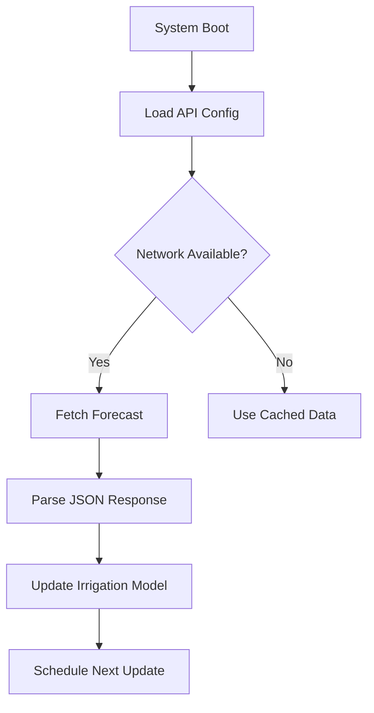
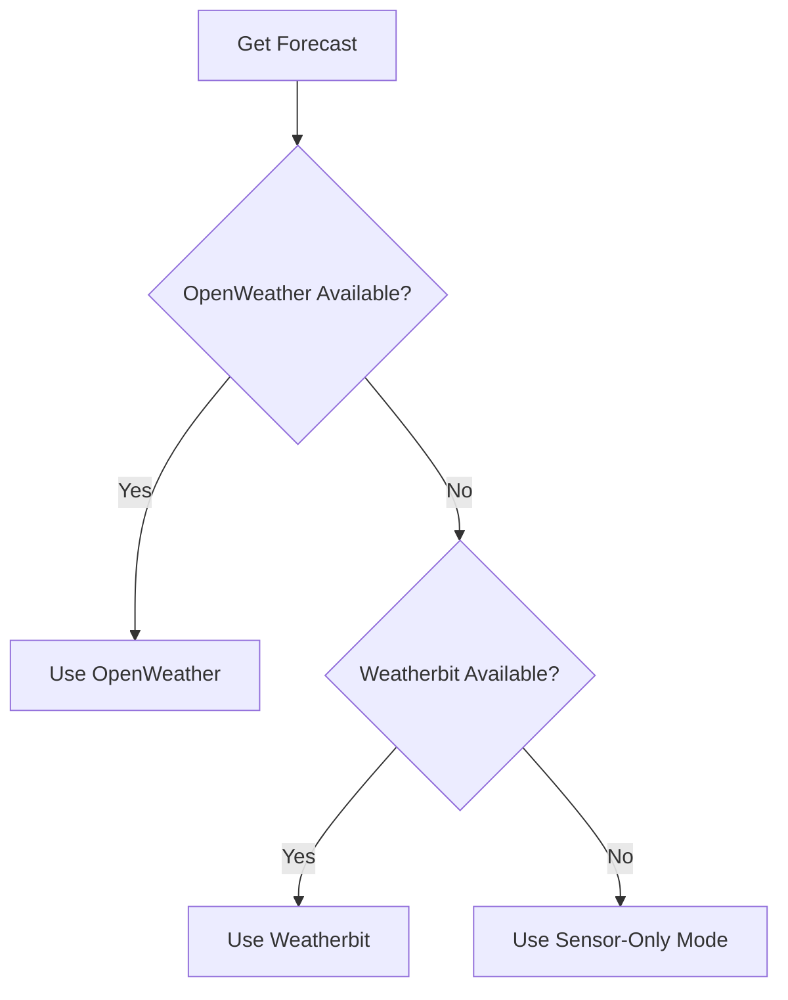

# Weather API Integration Guide

## Supported Services
| Provider | API Version | Free Tier | Parameters | Update Frequency |
|----------|-------------|-----------|------------|------------------|
| OpenWeather | OneCall 3.0 | 1K calls/day | Temp, Humidity, Precipitation | 1 hour |
| Weatherbit | Forecast 16d | 500 calls/day | Solar radiation, ET₀ | 1 hour |
| Climacell | V4 | Limited trial | Soil temp, Evapotranspiration | 15 min |

## OpenWeather Configuration

### 1. API Key Setup
```bash
# In config.h
#define OPENWEATHER_API_KEY "your_api_key_here"
#define LATITUDE 37.7749
#define LONGITUDE -122.4194
#define UNITS "metric"
```

### 2. Endpoint Configuration
```c
// Sample API call structure
const char* endpoint = 
  "https://api.openweathermap.org/data/3.0/onecall"
  "?lat=" LATITUDE_STR
  "&lon=" LONGITUDE_STR
  "&exclude=minutely,alerts"
  "&units=" UNITS
  "&appid=" OPENWEATHER_API_KEY;
```

### 3. Data Parsing
Key JSON elements:
```json
{
  "current": {
    "temp": 15.7,
    "humidity": 82,
    "rain": {"1h": 2.5}
  },
  "hourly": [
    {
      "dt": 1699984800,
      "pop": 0.95,
      "temp": 14.2,
      "rain": {"1h": 1.8}
    }
  ]
}
```

## Integration Workflow


## Advanced Features

### 1. Forecast Caching
```c
void update_forecast() {
  if(!wifi_connected()) {
    load_cached_forecast(); // From SPIFFS
    return;
  }
  
  http_get(API_ENDPOINT, [](const char* json) {
    parse_forecast(json);
    save_to_cache(json); // SPIFFS storage
  });
}
```

### 2. Multi-Provider Fallback


### 3. Rate Limiting
```c
// Rate limiting implementation
#define MAX_API_CALLS 48 // 24 hours * 2 calls/hour
static int api_call_count = 0;

bool can_call_api() {
  if(api_call_count < MAX_API_CALLS) {
    api_call_count++;
    return true;
  }
  return false;
}
```

## Error Handling

### Common Errors
| Code | Meaning | Resolution |
|------|---------|------------|
| 401 | Invalid API key | Verify key in OpenWeather dashboard |
| 404 | Location error | Validate latitude/longitude |
| 429 | Rate limit | Implement backoff algorithm |
| 500 | Server error | Retry with exponential backoff |

### Diagnostic Commands
```bash
# Test API connectivity
curl "https://api.openweathermap.org/data/3.0/onecall?lat=37.77&lon=-122.42&appid=YOUR_KEY"

# View cached forecast
cat /spiffs/forecast.json

# Reset API counter
systemctl restart amis-api
```

## Security Best Practices
1. **Key Rotation**
   ```c
   // Implement quarterly key rotation
   void rotate_api_key() {
     if(epoch_days() % 90 == 0) {
       fetch_new_key();
     }
   }
   ```
2. **Secure Storage**
   - Use ESP32 flash encryption
   - Store keys in NVS encrypted partition
3. **HTTPS Enforcement**
   - Always verify server certificates
   - Use TLS 1.3 only

## Sample Integration Code
```c
#include "openweather.h"

void fetch_weather() {
  WeatherForecast forecast = openweather_fetch();
  
  if(forecast.precip_prob > 0.7) {
    skip_watering("High rain probability");
  } else {
    adjust_irrigation(forecast.temp_avg);
  }
}
```
