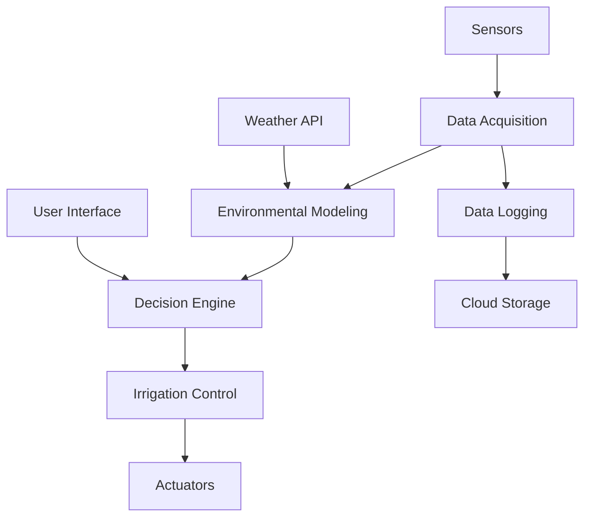
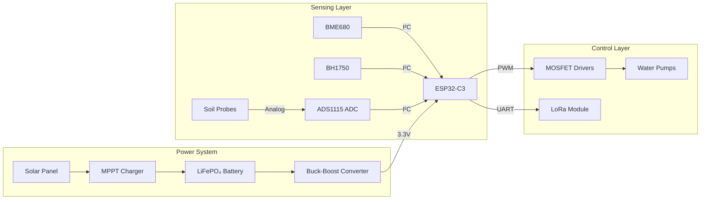
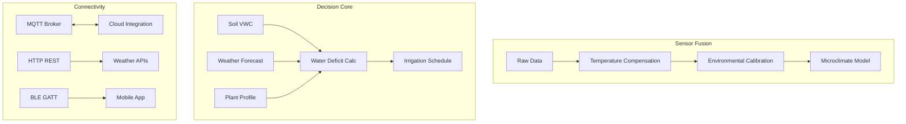
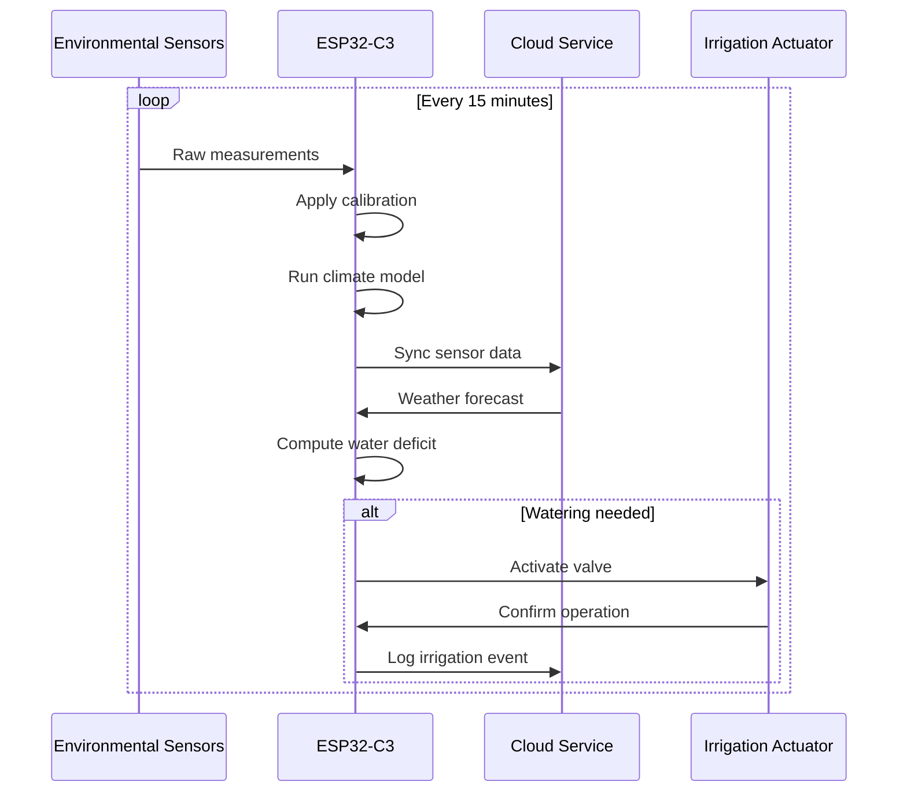

# Adaptive Microclimate Irrigation System (AMIS) Architecture

## System Overview


## Core Design Principles
1. **Environmental Responsiveness**
   - Real-time microclimate monitoring
   - Predictive weather integration
   - Soil-plant-atmosphere continuum modeling

2. **Energy Efficiency**
   - Solar-optimized power architecture
   - Sleep modes (95% duty cycle reduction)
   - Adaptive sampling rates

3. **Scalability**
   - Modular sensor/actuator interfaces
   - Distributed edge computing
   - Hybrid connectivity (LoRa/Wi-Fi/BLE)

4. **Resilience**
   - IP66-rated enclosure
   - Fault-tolerant sensor networks
   - Watchdog-protected firmware

## Hardware Architecture


## Software Architecture


## Key Design Choices

### 1. RISC-V MCU Selection
- **ESP32-C3** over ARM alternatives:
  - 40% lower power consumption
  - Built-in IEEE 802.11b/g/n Wi-Fi
  - Secure boot + flash encryption
  - 30% cost reduction

### 2. Hybrid Connectivity
| Protocol | Use Case | Range | Power |
|----------|----------|-------|-------|
| Wi-Fi    | Cloud sync | Medium | High |
| LoRaWAN  | Field mesh | Long | Low |
| BLE      | Local config | Short | Very Low |

### 3. Predictive Watering Model
```math
ET_c = K_c \times \left[ \frac{0.408\Delta(R_n - G) + \gamma\frac{900}{T+273}u_2(e_s - e_a)}{\Delta + \gamma(1 + 0.34u_2)} \right]
```
*FAO Penman-Monteith equation implementation*

### 4. Fault Tolerance Mechanisms
- Sensor health monitoring
- Pump current sensing
- Watchdog timer (HW + SW)
- Brown-out recovery
- Fail-safe dry contacts

## Data Flow

