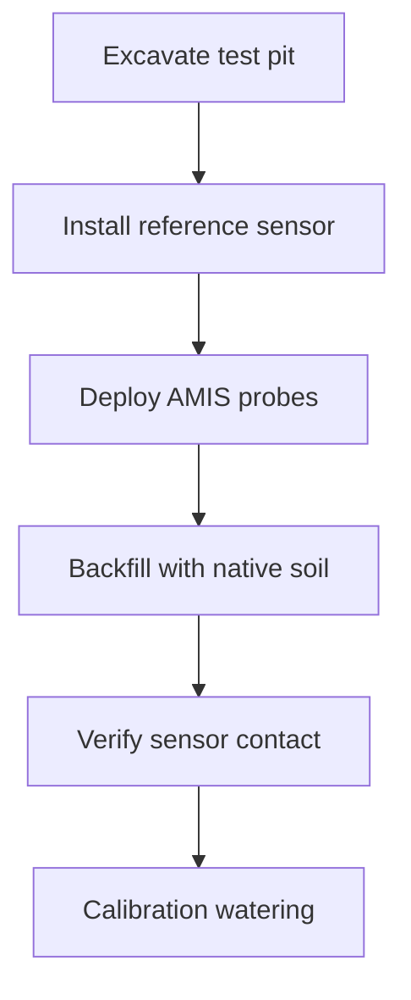
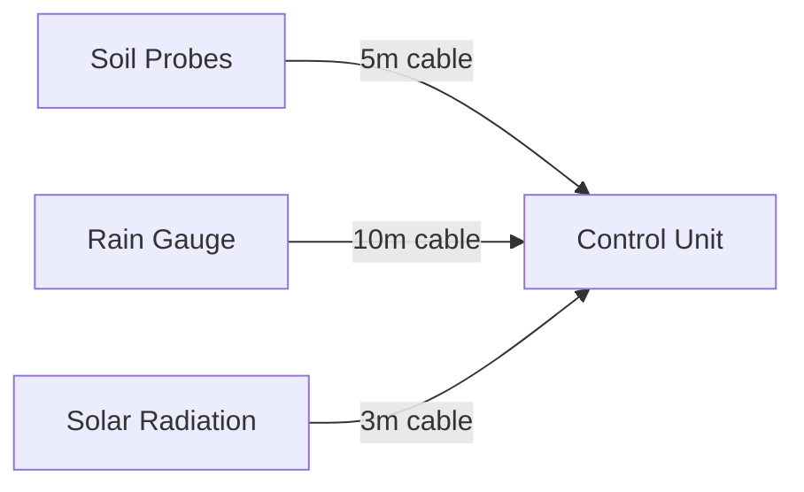
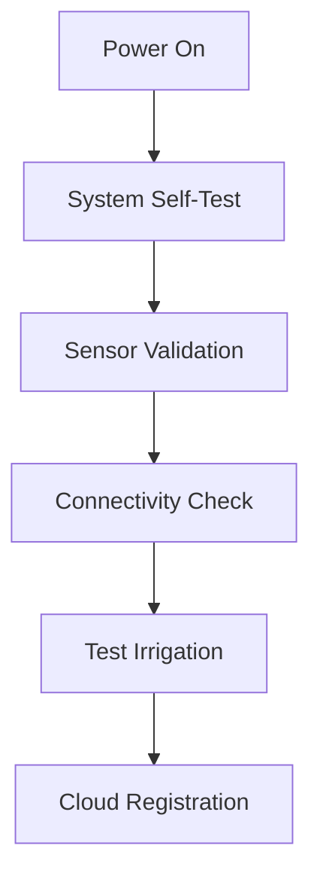

# Field Deployment Guide

## Site Preparation
### Optimal Placement Criteria
| Component | Height | Orientation | Spacing | Notes |
|-----------|--------|-------------|---------|-------|
| Control Unit | 1m above ground | North-facing wall | N/A | Avoid direct sun |
| Soil Probes | 15-30cm depth | Root zone area | 50cm apart | Avoid rocks |
| Rain Gauge | 2m above ground | Open area | 2m clearance | |
| Solar Panel | Tilt = Latitude | True south (NH) | No shading | 30° cleaning |

### Soil Sensor Installation


## Hardware Installation
### Step 1: Mount Control Unit
```bash
# Recommended tools:
# - IP66 enclosure
# - Stainless steel hardware
# - Dielectric grease

1. Attach mounting bracket to wall/post
2. Apply sealant to cable glands
3. Secure enclosure with M6 bolts
4. Ground to earth rod (10AWG min)
```

### Step 2: Install Sensors


### Step 3: Power System Setup
```bash
# Solar Wiring Diagram:
Solar Panel (+) -->|10AWG| Charge Controller (+)
Solar Panel (-) -->|10AWG| Charge Controller (-)
Charge Controller (B+) --> Battery (+)
Charge Controller (B-) --> Battery (-)
Battery (+) -->|Fused| Control Unit
Battery (-) --> Ground Bus
```

## Calibration Procedure
### Field Calibration Checklist
1. **Soil Moisture**
   ```bash
   ./calibrate soil dry   # Measure in air
   ./calibrate soil wet   # Measure in water
   ./calibrate soil field # Natural soil sample
   ```
   
2. **Rain Gauge**
   ```bash
   ./calibrate rain 10mm  # Pour 10mm water
   ```

3. **Light Sensor**
   ```bash
   ./calibrate light dark # Cover sensor
   ./calibrate light 1000lux # Use reference meter
   ```

### Post-Installation Verification


## Maintenance Schedule
| Task | Frequency | Tools |
|------|-----------|-------|
| Sensor Cleaning | Monthly | Soft brush |
| Battery Check | Quarterly | Multimeter |
| Full Calibration | Biannual | Calibration kit |
| Firmware Update | As released | USB programmer |

## Troubleshooting Guide
### Common Issues
| Symptom | Probable Cause | Solution |
|---------|----------------|----------|
| No irrigation | Clogged filter | Clean inlet screen |
| Battery drain | Solar panel shading | Trim vegetation |
| Data gaps | Antenna orientation | Reposition LoRa antenna |
| Sensor drift | Probe corrosion | Apply anti-corrosion gel |

### Diagnostic Commands
```bash
# Check system health
systemctl status amis

# View sensor readings
sensor-report --all

# Force irrigation test
irrigate --zone 1 --duration 10

# Connectivity test
network-test --full
```

## Environmental Compliance
| Region | Standard | Certification |
|--------|----------|---------------|
| EU | CE RED | EN 300 328 V2.2.2 |
| USA | FCC Part 15 | IC RSS-247 |
| Global | IP66 | IEC 60529 |
| Agriculture | EMC | EN 55032 Class B |
