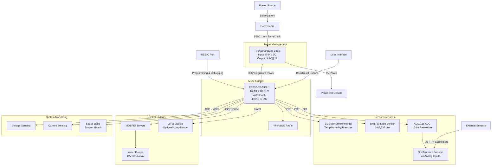
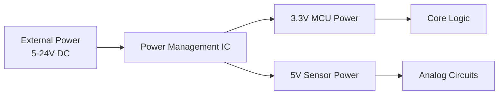
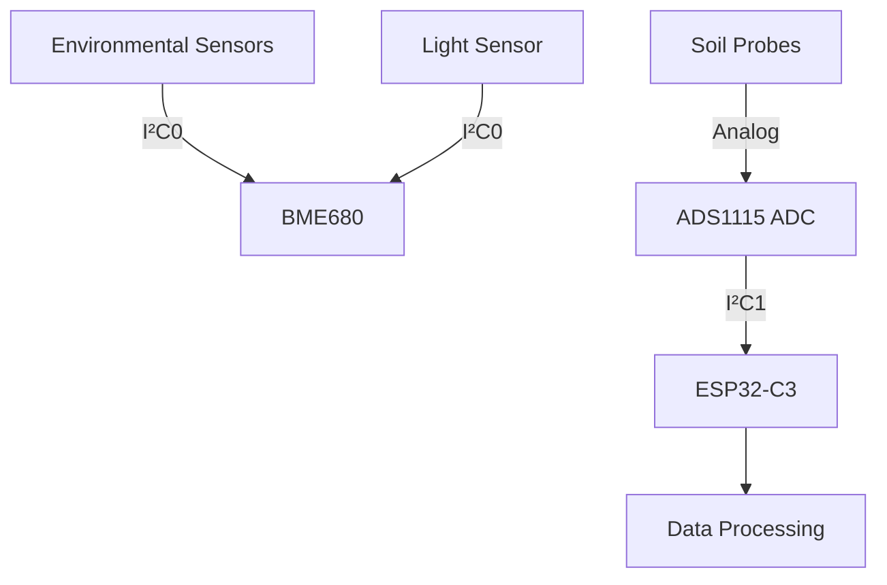
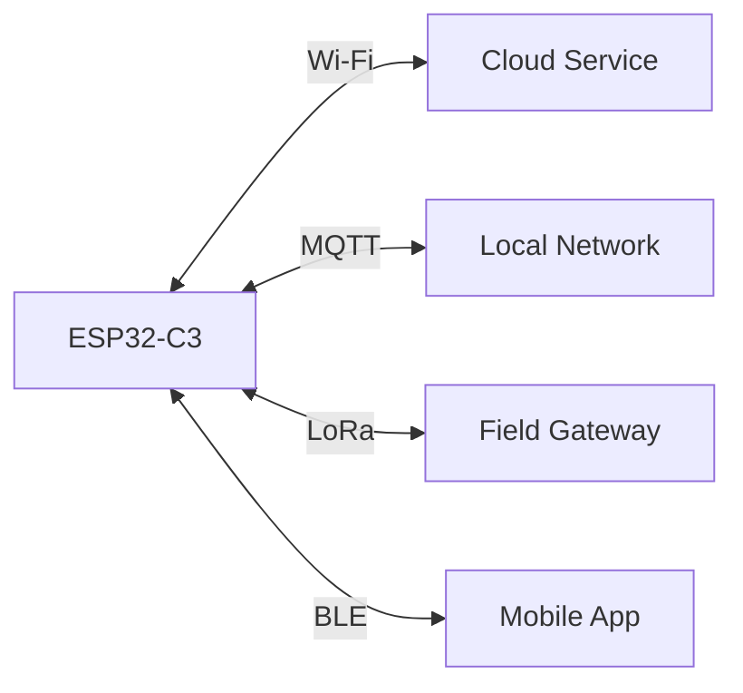
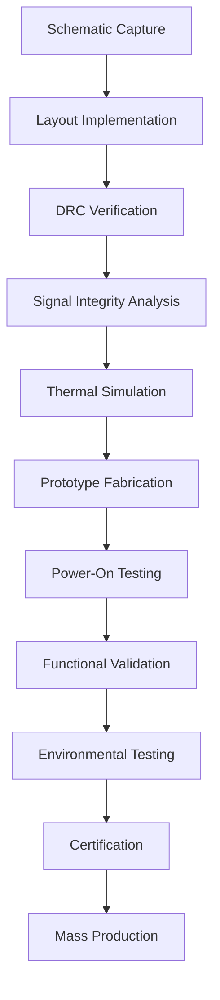

# PCB Signal Flow Architecture



## Signal Flow Explanation

### 1. **Power Path**


### 2. **Sensor Data Acquisition**


### 3. **Irrigation Control**


### 4. **Communication Flow**


## Key Design Features

1. **Power Isolation Architecture**
   - Dedicated LDOs for analog/digital sections
   - Star-point grounding for noise reduction
   - TVS diodes on all external interfaces

2. **Signal Integrity Measures**
   - Controlled impedance for I²C lines (100Ω differential)
   - Separate analog/digital ground planes
   - Guard rings around high-impedance soil inputs

3. **Fault Protection Systems**
   ```mermaid
   flowchart TD
       A[Overvoltage] -->|TVS Diodes| B[Clamping]
       C[Overcurrent] -->|Polyfuses| D[Current Limiting]
       E[ESD] -->|Spark Gaps| F[Discharge Paths]
       G[Reverse Polarity] -->|Schottky Diode| H[Blocking]
   ```

4. **Manufacturing Test Points**
   | Test Point | Purpose | Expected Value |
   |------------|---------|----------------|
   | TP1 | 3.3V Power | 3.3V ±2% |
   | TP2 | I²C0 Clock | 100kHz Square Wave |
   | TP3 | Pump PWM | Variable Duty Cycle |
   | TP4 | Soil Sensor Input | 0-3.3V Analog |
   | TP5 | Wi-Fi Activity | RF Signal |

## Design Verification Flow


## Revision History
| Version | Date       | Changes                     |
|---------|------------|----------------------------|
| v1.0    | 2023-10-20 | Initial Release            |
| v1.1    | 2023-11-05 | Added LoRa module footprint|
| v1.2    | 2023-11-18 | Improved thermal management|
